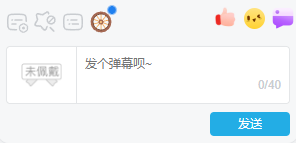

    

<h3>B站直播独轮车</h3>

# 功能

- 文字车
- 表情车
- 弹幕+1
- 弹幕复制

更多的功能正在添加中...

# 安装

**使用环境**

- 需要在浏览器上安装 [Tampermonkey最新正式版](https://tampermonkey.net/) 扩展插件

**注意事项**

- ~~还在旧版UI的同学请安装[1.3.6](https://github.com/ADJazzzz/BLSPAM/releases/tag/1.3.6)版本~~ 新版本（`1.3.8`版本及以上）已支持新旧两种UI布局
- 若Tampermonkey版本 >= `5.3.2`，需要在浏览器扩展页面开启`开发者模式` [详见](https://www.tampermonkey.net/faq.php#Q209)
- 使用独轮车可能会对直播间环境造成污染，若你的账号被封禁或禁言，本脚本、作者以及贡献者不负任何责任
- 本脚本会使用你的账号信息用于对B站相关API请求
- 本脚本只会对B站相关域名、依赖CDN 和 Github API 发起请求
- 部分地区可能无法从 CDN 获取相关依赖，请尝试修改host或开魔法

**安装**

|                                              Github min                                              |                                              Github                                              |                                    greasyfork                                     |
| :--------------------------------------------------------------------------------------------------: | :----------------------------------------------------------------------------------------------: | :-------------------------------------------------------------------------------: |
| [安装](https://github.com/ADJazzzz/BLSPAM/releases/latest/download/bilibili-live-spamer.min.user.js) | [安装](https://github.com/ADJazzzz/BLSPAM/releases/latest/download/bilibili-live-spamer.user.js) | [安装](https://update.greasyfork.org/scripts/481738/Bilibili-Live-Spamer.user.js) |

> Github的两个版本没有区别，推荐使用min版

### 参与开发

请阅读 [CONTRIBUTING](https://github.com/ADJazzzz/BLSPAM/blob/main/CONTRIBUTING.md)

### 更新日志

[CHANGELOG](https://github.com/ADJazzzz/BLSPAM/blob/main/CHANGELOG.md)

# 使用

脚本启用后，在直播间聊天框上显示脚本入口，使用前请**登录**。（不登录你车什么😅）

> 右上角为状态显示，**蓝色**为可使用状态，**红色**为不可使用状态（未登录，API异常等），**绿色**为正在运行独轮车

# 兼容

- 脚本管理器中只对 [Tampermonkey](https://tampermonkey.net/) 做过兼容测试，使用其他的脚本管理器可能会出现不兼容的情况
- 浏览器中支持**最新**版本的Chrome，Edge (Chromium 内核)，Firefox，不保证脚本在其他的浏览器或者长时间没更新的浏览器中正常运行
- 与其他脚本的兼容性

| [BLTH](https://github.com/andywang425/BLTH) | [Bilibili Evolved](https://github.com/the1812/Bilibili-Evolved) |
| :-----------------------------------------: | :-------------------------------------------------------------: |
|                     ✅                      |                               ✅                                |

# 第三方组件

本脚本使用了以下组件进行开发：

- [Vue.js](https://github.com/vuejs/core)
- [vite](https://vitejs.dev)
- [vite-plugin-monkey](https://github.com/lisonge/vite-plugin-monkey)
- [pinia](https://github.com/vuejs/pinia)
- [naive-ui](https://www.naiveui.com)
- [axios](https://axios-http.com)
- [lodash](https://lodash.com)
- [mitt](https://github.com/developit/mitt)
- [bilibili API collect](https://github.com/SocialSisterYi/bilibili-API-collect)
- [twemoji](https://github.com/twitter/twemoji)
- [xicons](https://github.com/07akioni/xicons)

😘感谢这些组件为本项目极大地提高了开发效率

# 相关推荐

### BLTH - Bilibili Live Tasks Helper

作者: [andywang425](https://github.com/andywang425)

- [GitHub](https://github.com/andywang425/BLTH)

### Bilibili Evolved

作者：[the1812](https://github.com/the1812)

- [Github](https://github.com/the1812/Bilibili-Evolved)

## 一些碎碎念

这个独轮车脚本本来是在我Fork的 [BLTH](https://github.com/ADJazzzz/BLTH-Fork) 上添加的功能，但开发过程中想到独轮车好像与其理念（我认为BLTH是为用户提供更好的直播体验而设计的）相背，因此独立出来了。同时可以看到本脚本和BLTH的框架基本一样，部分代码一样（如dom），是因为懒得再造一个所以直接拿过来用了。
